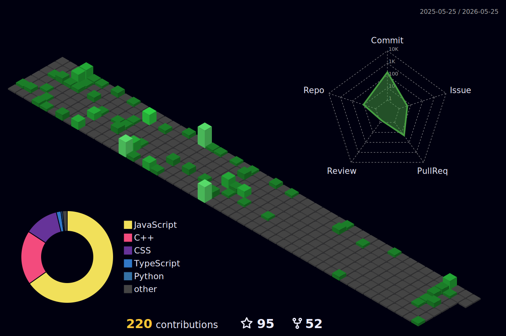

<p align="center">

</p>

---

<p align="center">
   🌱Founder | Code, Copy, and Connection | Minimalist Build Forward🌱
</p>  

---

<p align="center">
  <picture>
    <source media="(prefers-color-scheme: dark)" srcset="https://raw.githubusercontent.com/serenvdmerwe/serenvdmerwe/output/github-contribution-grid-snake-dark.svg" />
    <source media="(prefers-color-scheme: light)" srcset="https://raw.githubusercontent.com/serenvdmerwe/serenvdmerwe/output/github-contribution-grid-snake.svg" />
    
  </picture>
</p>
  
---

<div align="center">

```yaml
# 💡 About Me

- 🔍 Being Learnered and Hungry to Know Different and New Forms of Doing
- ✨ Emphatic on Diverse Tool Development Methods
- 🌀 Creative Design and UX is a Joy for me
- 💼 Working in Development for me is a form of Art and Expression
- ➰ Coding is in our DNA as Mathematics
```
</div>

---

## Contribution Calendar 
<br>
<p align='center'>
 
</p>
<hr>
<br>

---

## Current focus:

> “ Developing innovative AI and NON AI solutions in the Web Development Sector specifing in the development of WordPress themes and plugins, and AI-driven logistic. I do so love to trial new solutions as my past time.”

---

<!--
**serenvdmerwe/serenvdmerwe** is a ✨ _special_ ✨ repository because its `README.md` (this file) appears on your GitHub profile.

Here are some ideas to get you started:

- 🔭 I’m currently working on ...
- 🌱 I’m currently learning ...
- 👯 I’m looking to collaborate on ...
- 🤔 I’m looking for help with ...
- 💬 Ask me about ...
- 📫 How to reach me: ...
- 😄 Pronouns: ...
- ⚡ Fun fact: ...
-->

---

<p align="center">
  
</p>
